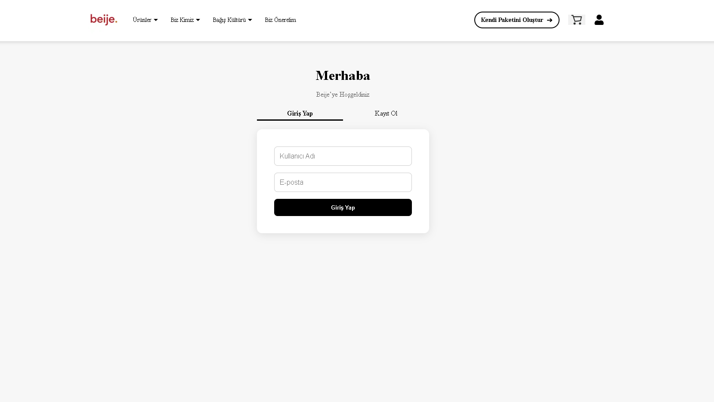
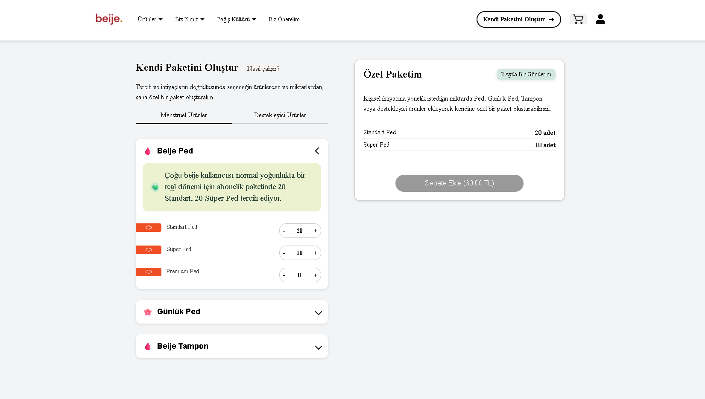

# 🧃 Custom Package Project

A full-stack web application that allows users to **create their own personalized care packages** by selecting products and quantities based on their needs and preferences.

Built with a **Next.js + NestJS** stack, this project demonstrates clean architecture, reusable components, and a strong focus on user experience.

---

## 🚀 Tech Stack

### **Frontend**
- [Next.js 18 (App Router)](https://nextjs.org/docs/app)
- TypeScript
- React Hooks & Context API (for global state management)
- TailwindCSS
- Vercel (for deployment)

### **Backend**
- [NestJS](https://nestjs.com/)
- TypeORM
- PostgreSQL
- Nodemailer (for email verification)
- RESTful API design principles

---

## 💡 Features

- 🧑‍💻 **User Registration & Email Verification** — Users register with an email, receive a verification link, and activate their account.
- 📦 **Custom Package Builder** — Users can choose products and define quantities dynamically.
- 🧠 **Global State Management** — Implemented with React Context for seamless data sharing across components.
- 📤 **Real-time Updates** — Automatically updates selected items and total count.
- 💅 **Responsive Design** — Clean, minimal UI optimized for all devices.

---

## 🏗️ Project Structure

### **Frontend**


## 🖥️ Frontend Screenshots

### 1️⃣ Login & Registration

Users start at the **Login / Registration page**. Here they can:

- Enter their **username** and **email** to register.
- Upon registration, a verification email is sent automatically (via Nodemailer + SMTP).
- Users must **verify their email** by clicking the link before accessing the main app.
- Once verified, the user can log in and proceed to the Custom Package Builder.



---

### 2️⃣ Custom Package Builder (Home Page)

After login and verification, users land on the **Custom Package Builder page**. Features include:

- Selecting products from different categories (e.g., Menstrual Products, Supportive Products).
- Adding desired quantities for each product dynamically.
- Real-time update of the selected items list and total count.
- A summary panel showing the current “My Custom Package” selections.
- Interactive UI elements (AccordionItems, selection highlights, etc.).
- Fully responsive layout, optimized for all devices.




---

## 🔧 Backend & Email Verification

The backend is implemented with **NestJS** and handles **user registration, email verification, and verification checks**. Emails are sent using **Nodemailer** via Gmail SMTP with a secure **App Password**.  

### **API Endpoints**

#### 1️⃣ Register User

**POST** `/user/register`

- **Request Body:**
```json
{
  "username": "exampleUser",
  "email": "user@example.com"
}


Action:

Generates a random alphanumeric verificationToken.

Saves { username, email, verificationToken, isVerified } to the database (isVerified is initially false).

Sends an email with the verification token link via your Gmail account using App Password.

Possible Responses:

200 OK — User successfully registered.

400 Bad Request — Missing fields, or username/email already exists.


2️⃣ Verify Email

GET /user/verify-email/{username}/{verificationToken}

Action:

Finds the user by username.

Compares the provided verificationToken with the database.

If valid, sets isVerified = true.

Possible Responses:

200 OK — Email successfully verified ✅

400 Bad Request — Token mismatch ❌

404 Not Found — User not found ❌

Example Verification URL:
http://localhost:3000/user/verify-email/exampleUser/abc123token


3️⃣ Check Verification Status

GET /user/check-verification?username=exampleUser&email=user@example.com

Action: Checks whether the user is verified.

Possible Responses:

200 OK — User is verified ✅

400 Bad Request — User exists but email is not verified ❌

404 Not Found — User not found ❌

🛠️ Development Notes

Global State Management: Implemented using React Context API to manage user selections across pages seamlessly.

Email Sending: Nodemailer uses Gmail SMTP and App Passwords for security. Emails are sent to any valid recipient, not limited to the developer’s email.

Error Handling: Backend provides proper HTTP status codes to signal success or failure for all user actions.

Frontend: Responsive UI with real-time updates of selected products and totals.

Testing: Can be tested using Postman, Insomnia, or directly via frontend UI.

✅ Summary

This project demonstrates:

Full-stack development with Next.js + NestJS

Email verification workflow using Nodemailer

Secure use of Gmail App Passwords

Dynamic, responsive front-end UI for custom package creation

Global state management via React Context API

With this setup, users can safely register, verify their emails, and create personalized care packages with instant feedback.


